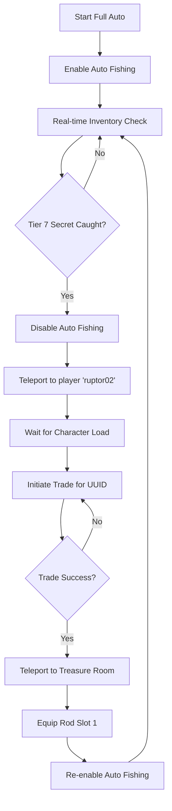

# v2.lua Operational Flow

This document describes the sequential execution and logic flow of the `v2.lua` script.

## 1. Initial Execution Phase (Immediate Mobilization)
Upon script injection, the following steps occur simultaneously or in rapid succession:

1.  **UI Initialization**: `WindUI` is loaded and the main "ErHub V2" window is created.
2.  **Immediate Teleport**: `TeleportToTreasureRoom()` is called to move the player to the primary farming location.
3.  **Asset Engagement**: After a 1-second delay, `equipFishingToolFromHotbar(1)` is executed to ensure the rod is ready.
4.  **Environment Optimization**: `ContinuousFPSBoost()` starts immediately, stripping the game of performance-heavy assets (materials, shadows, foliage).
5.  **Security Initialization**: `Anti-AFK` via `VirtualUser` and the `AutoReconnect` loop are started in the background.

## 2. Automated Production Phase (Fishing)
When the **Auto Fishing** toggle is enabled:

1.  **Remote Invocation Loop**:
    *   `rodRemote:InvokeServer(100, 1)` (Charge/Cast)
    *   Wait 0.5s
    *   `miniGameRemote:InvokeServer()` (Start Minigame)
    *   Wait 2.0s
    *   `finishRemote:FireServer(true)` (Complete/Catch)
2.  **Animation Control**: Fishing animations are handled by the game engine, triggered by the remote calls.

## 3. Intelligent State Machine (Full Auto)
When the **Full Auto** toggle is enabled, a specialized background monitor starts:

## 4. Error Handling & Recovery
*   **Data Integrity**: Every data fetch uses `SafeGet` to prevent script crashes on `nil` values from `Replion`.
*   **Network Stability**: `AutoReconnect` monitors player presence and re-teleports/reloads the session if a disconnect is detected.
*   **Trade Safety**: Trade calls are wrapped in `pcall` to handle unexpected failures without stopping the entire automation.
